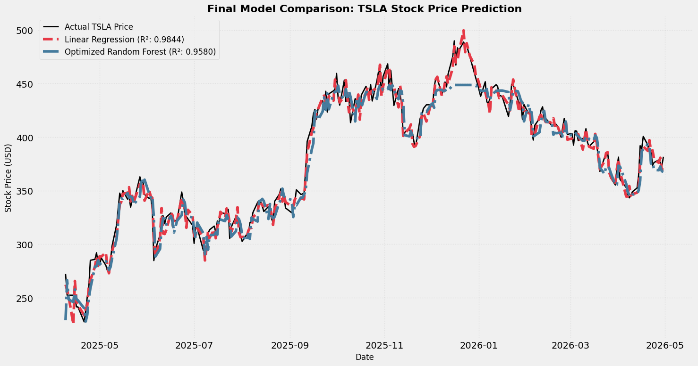

# Time-Based Stock Price Prediction for TSLA

An end-to-end data science and machine learning pipeline to forecast Tesla (TSLA) stock prices using historical market data. This project implements a rigorous chronological split strategy, constructs rolling indicators, and evaluates the performance trade-offs between traditional linear models and optimized tree-based ensembles.

Developed as part of the Data Science & Machine Learning Internship at **Brainybeam Info-Tech PVT LTD**.

---

## 📌 Project Overview
Predicting stock market variations requires models that capture recent momentum without introducing future bias. This project explores financial forecasting by utilizing past closing prices and Simple Moving Averages (SMAs) to predict the current day's closing price. 

A core focus of this implementation is analyzing the structural limitations of machine learning algorithms—specifically, why linear models can outperform complex tree ensembles when a stock breaks out into historic price zones.

## 🛠️ Technology Stack & Libraries
* **Language:** Python
* **Environment:** Google Colab / Jupyter Notebooks
* **Data Sourcing:** `yfinance` (Yahoo Finance API)
* **Data Manipulation:** `pandas`, `numpy`
* **Modeling & Tuning:** `scikit-learn` (LinearRegression, DecisionTreeRegressor, RandomForestRegressor, GridSearchCV)
* **Visualization:** `matplotlib`, `seaborn`

---

## ⚙️ Data Pipeline & Feature Engineering

### 1. Data Collection
Historical daily data for **TSLA** was pulled directly via the Yahoo Finance API spanning a 5-year window.

### 2. Feature Generation
To provide predictive signals based on historical momentum, the following features were engineered:
* **Lag Features (`Lag_1`, `Lag_2`, `Lag_3`):** The closing prices from 1, 2, and 3 trading days prior.
* **Technical Indicators (`SMA_5`, `SMA_10`):** 5-day and 10-day Simple Moving Averages to smooth short-term fluctuations and track baseline direction.

### 3. Strict Temporal Splitting (No Data Leakage)
Traditional random train-test splitting violates the fundamental axiom of time-series analysis by allowing future data points to leak into past predictions. To simulate real-world trading conditions, an **80/20 chronological time-based split** was strictly enforced:
* **Training Samples:** 1,062 trading days 
* **Testing Samples:** 266 trading days 

---

## 📊 Model Performance Summary

The models were evaluated using four key metrics: Mean Absolute Error (MAE), Mean Squared Error (MSE), Root Mean Squared Error (RMSE), and the Coefficient of Determination ($R^2$).

| Model | MAE | MSE | RMSE | R² Score | Key Behavioral Characteristic |
| :--- | :--- | :--- | :--- | :--- | :--- |
| **Linear Regression** | \$5.82 | 56.34 | \$7.51 | **0.9844** | **Top Performer.** Excellent at capturing continuous linear momentum and extrapolating trends. |
| **Baseline Decision Tree** | \$10.13 | 177.13 | \$13.31 | 0.9510 | High variance. Prone to abrupt step-like adjustments during volatile periods. |
| **Optimized Random Forest** | \$9.33 | 170.49 | \$13.06 | 0.9580 | Improved through hyperparameter tuning, but bounded fundamentally by training bounds. |

### 🔧 Hyperparameter Tuning
Grid Search Cross-Validation (`GridSearchCV`) was deployed on the Random Forest regressor to determine optimal parameters, resulting in an performance boost (increasing $R^2$ from `0.9528` to `0.9580`):
* `max_depth`: 10
* `min_samples_split`: 10
* `n_estimators`: 100

---

## 🔍 Critical Insights & Technical Takeaways

### 1. The Extrapolation Flaw of Tree Ensembles
While Random Forest is highly flexible and structurally robust against outliers, it exhibits a distinct limitation in financial forecasting. During the test window, TSLA broke out to historic highs near \$500. 

Because tree-based models make predictions by averaging target values found in leaf nodes, **they cannot extrapolate outputs beyond the absolute maximum value encountered in their training data.** On a final comparison plot, this reveals itself as a flat line ceiling during unprecedented market rallies.

### 2. Why Linear Regression Won
Linear Regression computes a continuous mathematical hyperplane. Because the engineered feature space (`Lag_1`, `SMA_5`) scaled upwards linearly along with the true stock price, the linear equation cleanly extended its trajectory into uncharted pricing territory, making it significantly more accurate for trending market data.

---

## 🚀 How to Run the Notebook
1. Open [Google Colab](https://colab.research.google.com/).
2. Clone this repository or upload the `.ipynb` notebook file.
3. Execute the cells sequentially. The data fetches dynamically via `yfinance`, meaning no manual dataset downloading or local path configuration is required.
